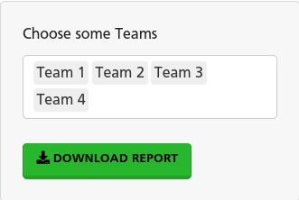
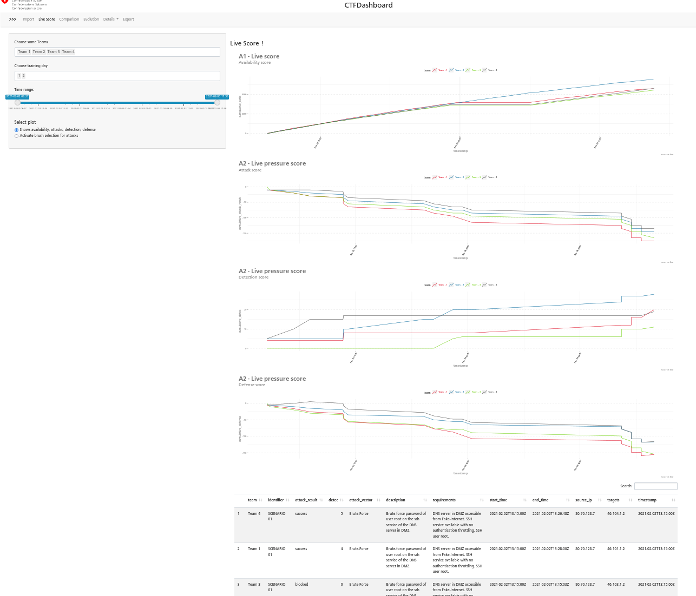

class: center, middle

```{r setup, include=FALSE}
options(htmltools.dir.version = FALSE)
```

```{r xaringanExtra, echo=FALSE}
xaringanExtra::use_xaringan_extra(c("tile_view", "animate_css", "tachyons","fit_screen"))
xaringanExtra::use_logo(
  image_url = "img/logo-CH.svg",
  position = xaringanExtra::css_position(top = "0em", left = "0em"),
  width = "252px",
  height = "55.75px"
)

xaringanExtra::use_panelset()

xaringanExtra::use_scribble()

xaringanExtra::use_broadcast()

#use_scribble(
#  pen_color = "#FF0000",
#  pen_size = 3,
#  eraser_size = pen_size * 10,
#  palette = NULL
#)

```

```{r xaringan-editable, echo=FALSE}
# (by default values expire in 2 weeks).
xaringanExtra::use_editable()
```


# CTFDashboard

---
class: inverse, center, middle

# What is Capture The Flag (CTF) Event ?

<iframe width="800" 
height="450" 
src="https://www.youtube.com/embed/meC8O9Mptz4" 
title="YouTube video player" frameborder="0" 
allow="accelerometer; autoplay; clipboard-write; 
encrypted-media; gyroscope; 
picture-in-picture" allowfullscreen>
</iframe>

---

# Specific CTF Setup


---
class: left

# Dashboard's goals


.footnote[
[1] Situation awareness

[2] Performance indicators

[3] Debriefing]

---
class: inverse, center, middle

# Get Started - with data

---

# Data: Availability
.panelset[
.panel[.panel-name[Data]
```
A tibble: 20,322 x 7
timestamp           success total service fct      ratio team  
<dttm>                <dbl> <dbl> <chr>   <chr>    <dbl> <chr> 
1 2021-02-02 07:27:16       3     3 dns     ssh          1 Team 1
2 2021-02-02 07:27:16       2     2 website register     1 Team 1
3 2021-02-02 07:27:26       4     4 website index        1 Team 1
4 2021-02-02 07:28:16       1     1 website comments     1 Team 1
5 2021-02-02 07:28:26       1     1 mail    sending      1 Team 1
6 2021-02-02 07:28:26       4     4 dns     ssh          1 Team 1
7 2021-02-02 07:28:36       2     2 website register     1 Team 1
8 2021-02-02 07:28:56       1     1 website register     1 Team 1
9 2021-02-02 07:29:26       1     1 website comments     1 Team 1
10 2021-02-02 07:29:36       1     1 website comments     1 Team 1
```
]
.panel[.panel-name[Plot Availability summary]

]
.panel[.panel-name[Plot Availability]

]
]
---
## Data: Attack + Detection = Defense

.panelset[
.panel[.panel-name[Data]
```{r, eval=FALSE}
# A tibble: 85 x 12
team   identifier weight attack_vector description requirements start_time end_time source_ip
<chr>  <chr>       <dbl> <chr>         <chr>       <chr>        <chr>      <chr>    <chr>    
1 Team 4 SCENARIO …      1 Brute-Force   Brute-forc… DNS server … 2021-02-0… 2021-02… 80.70.12…
2 Team 1 SCENARIO …      1 Brute-Force   Brute-forc… DNS server … 2021-02-0… 2021-02… 80.70.12…
3 Team 3 SCENARIO …      1 Brute-Force   Brute-forc… DNS server … 2021-02-0… 2021-02… 80.70.12…
4 Team 2 SCENARIO …      1 Brute-Force   Brute-forc… DNS server … 2021-02-0… 2021-02… 80.70.12…
5 Team 2 SCENARIO …      1 Network Reco… PING sweep… DMZ can be … 2021-02-0… 2021-02… 103.76.1…
6 Team 4 SCENARIO …      1 Network Reco… PING sweep… DMZ can be … 2021-02-0… 2021-02… 103.76.1…
7 Team 3 SCENARIO …      1 Network Reco… PING sweep… DMZ can be … 2021-02-0… 2021-02… 103.76.1…
8 Team 1 SCENARIO …      1 Network Reco… PING sweep… DMZ can be … 2021-02-0… 2021-02… 103.76.1…
9 Team 2 SCENARIO …      1 Network Reco… PING sweep… DMZ can be … 2021-02-0… 2021-02… 20.143.2…
10 Team 4 SCENARIO …      1 Network Reco… PING sweep… DMZ can be … 2021-02-0… 2021-02… 20.143.2…
# … with 75 more rows, and 3 more variables: targets <chr>, detec <dbl>, attack_result <chr>
```
]
.panel[.panel-name[Plot Attack]

]
.panel[.panel-name[Plot Detection]

]
.panel[.panel-name[Plot Defense]

]
]
---

# Data: Report

.panelset[
.panel[.panel-name[Data]
```{r, eval=FALSE}
# A tibble: 8 x 10
report description  team_1_score team_1_comment    team_2_score team_2_comment    team_3_score
<chr>  <chr>               <dbl> <chr>                    <dbl> <chr>                    <dbl>
1 1      Breifing 1 …            5 Good summary, cl…            5 clear, team mana…            4
2 2      Network Dia…            1 Machine network …            4 Good overview, m…            2
3 3      Monitoring …            2 Idea given, very…            1 Nothing tangible…            1
4 4      Briefing 2 …            0 NA                           0 NA                           0
5 5      Hardening R…            3 NA                           2 NA                           1
6 6      Briefing 3 …            1 clear explanatio…            2 management and a…            1
7 7      Briefing 4 …            0 NA                           0 NA                           0
8 8      Briefing 5 …            0 NA                           0 NA                           0
# … with 3 more variables: team_3_comment <chr>, team_4_score <dbl>, team_4_comment <chr>
```
]
.panel[.panel-name[Plot]

]
]
---

# Data: Soft Skills

.panelset[
.panel[.panel-name[Data]
```{r, eval=FALSE}
# A tibble: 3 x 9
criteria  team_1_score team_1_comment  team_2_score team_2_comment team_3_score team_3_comment
<chr>            <dbl> <chr>                  <dbl> <chr>                 <dbl> <chr>         
1 Communic…            1 troubles with …            2 clear communi…            2 they communic…
2 Collabor…            1 difficult to m…            2 mostly by pai…            2 leadership is…
3 Balance              1 NA                         2 NA                        2 NA            
# … with 2 more variables: team_4_score <dbl>, team_4_comment <chr>
```
]
.panel[.panel-name[Plot]

]
]

---
class: inverse, middle, center

# The shiny app

---

# Design - concept


1. Data importation

1. Live Defense > Tab shown during the CTF
    
1. Comparison > team benchmarking over 5 criteria

1. Evolution > allow team's progress

1. Details > for specific highlights or discussion details

1. Export > Allow Team to get their performance report

---

# App challenges

.panelset.sideways[
.panel[.panel-name[Summary]
1. Data standardization and code re-use <sup>1</sup>
1. Data transfer between module
1. Time manipulation and slider <sup>2</sup>
1. Evolution of table -> a new way of presenting data : dumbbell plot<sup>7</sup>
1. Export with pdf markdown headache and corporate fonts (Frutiger) <sup>3</sup>
1. Persistent configuration
1. Time of last update vs current time <sup>2</sup>
1. Custom theme <sup>4 6</sup>
1. Human interaction - layout and controls choices
1. Plot adaptation to shiny <sup>5</sup>
]
.panel[.panel-name[Day 1 vs Day 2]

]
.panel[.panel-name[Defense period]

]
.panel[.panel-name[Persistent config]
```{r, eval=FALSE}
mod_04_live_server <- function(id, r) {
  moduleServer(id, function(input, output, session) {
    ns <- session$ns
    ......
     observeEvent( input$team_selected , {
      r$config$team_selected <- input$team_selected
    })
    
    observeEvent( r$config$team_selected ,{ 
      req(r$dataset$summary())
      colonnes <- get_team_list(r$dataset$summary())
      updateSelectInput(session,
                        "team_selected",
                        choices = colonnes,
                        selected = r$config$team_selected)
    })
```
]
.panel[.panel-name[Theme]
After doing ggplot2 custome theme, [admin swiss styleguide](https://swiss.github.io/styleguide/en/), the winner is `bslib` and `thematic`
```{r, eval=FALSE}
##############################
# bslib theme - shiny app
#############################
my_theme <- bslib::bs_theme(
  version = 4,
  bootswatch = "lumen",
  base_font = 'Frutiger')
```
]
.panel[.panel-name[Controls]
.pull-left[] 
.pull-right[]
]
]

.footnote[
[1]   
[2]  [3]  
[4]  [5] 
[6]  [7]   [8] DT [9] bslib
]
---

# Design evolution

.panelset[
.panel[.panel-name[Old]

]
.panel[.panel-name[New]

]
]

???

## TODO
[x] live move from ++++ to / / / / 
[x] change activate brush to button selection
[x] evolution add a tittle to button
[/] checkboxGroupInput
[x] change to config for day selected (Availability, detection, live)
[x] change show data per service too radio button 
 data per serice
 data per team it was a checkbox move to radio button
- availability
- detection
- report
- soft skills
[x] Add plots in report
[x] check Readme.Rmd


---
# Future challenges

1. Add Time to detection metric
    
    + Collect precise logs about detection (timestamp)
    
    + Analyse and linked them with attacks to determine Time to detection metric
    
    + Produce a dumbbell plot

1.  Use `thematic` for theme in the whole app
    
    + refactor dedicated theme in ggplot2


---
class: inverse, left

# Feedback

.can-edit[You can edit this to give feedback]

---
class: center, top

# Thanks!

.bg-washed-green.b--dark-green.ba.bw2.br3.shadow-5.ph4.mt5[
@Extension school team, Giulia, Enrico, Iegor, 

for support and nice events
]

.footnote[
.right[
Slides created via the R package [**xaringan**](https://github.com/yihui/xaringan).

Icon comes from [Noun Project](https://thenounproject.com)
]
]

---

# Screenshot: Export


---

# Screenshot: Evolution


??? 
usethis::use_github_pages(branch='publish',path = "/docs")